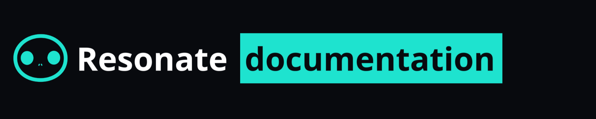

# Resonate open-source documentation repo

## About this repository

This repo contains Resonate documentation and the website framework that is served to [https://docs.resonatehq.io](https://docs.resonatehq.io)

- [Contribute to Resonate Documentation](./CONTRIBUTING.md)
- [License](./LICENSE)

## Directory

- [Get started with Resonate](https://docs.resonatehq.io/get-started)
  - [Try an example application](https://github.com/resonatehq-examples)
- [Join the community](https://resonatehq.io/discord)
  - [Subscribe to Resonate HQ](https://journal.resonatehq.io/subscribe)
  - [Follow on Twitter / X](https://twitter.com/resonatehqio)
  - [Follow on LinkedIn](https://www.linkedin.com/company/resonatehqio)
  - [Subscribe on YouTube](https://www.youtube.com/@resonatehqio)

## Distributed Async Await

Resonate implements the Distributed Async Await specification — [Learn more](https://www.distributed-async-await.io/)

## Why Resonate

Because developing distributed applications should be a delightful experience — [Learn more](https://docs.resonatehq.io/evaluate/why-resonate)

## Available SDKs

Add reliablity and scalability to the language you love.

|                                                      Language                                                       | Source Code                                   | Package                                              | Developer docs                                        |
| :-----------------------------------------------------------------------------------------------------------------: | --------------------------------------------- | ---------------------------------------------------- | ----------------------------------------------------- |
|    | https://github.com/resonatehq/resonate-sdk-py | [pypi](https://pypi.org/project/resonate-sdk/)       | [docs](https://docs.resonatehq.io/develop/python)     |
|  | https://github.com/resonatehq/resonate-sdk-ts | [npm](https://www.npmjs.com/package/@resonatehq/sdk) | [docs](https://docs.resonatehq.io/develop/typescript) |
