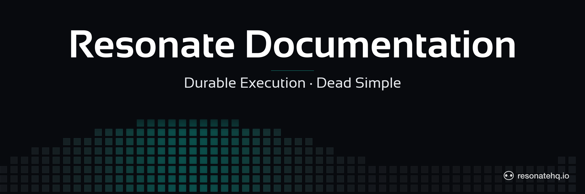

<p align="center">
  <picture>
    <source media="(prefers-color-scheme: dark)" srcset="./public/images/resonate-documentation-banner-dark.png">
    <source media="(prefers-color-scheme: light)" srcset="./public/images/resonate-documentation-banner-light.png">
    
  </picture>
</p>

[](https://docs.resonatehq.io)
[](https://opensource.org/licenses/Apache-2.0)

# Resonate documentation

Source for [docs.resonatehq.io](https://docs.resonatehq.io), the documentation site for Resonate. This repo holds the site; the docs themselves live at the deployed URL. Built with Next.js 15 + fumadocs, deployed to Vercel on push to `main`.

## Run locally

Clone the repo and install dependencies:

```shell
git clone https://github.com/resonatehq/docs.resonatehq.io.git
cd docs.resonatehq.io
npm install
```

Start the development server:

```shell
npm run dev
```

Before opening a pull request, run a production build. It regenerates `llms.txt` and runs the link checker:

```shell
npm run build
```

## Contributing

Content lives as MDX under `content/docs/`. Read [CONTRIBUTING.md](./CONTRIBUTING.md) before opening a pull request.

## Community

- [Join the Discord](https://resonatehq.io/discord)
- [Subscribe to the Journal](https://journal.resonatehq.io/subscribe)
- [Follow on X](https://x.com/resonatehqio)
- [Follow on LinkedIn](https://www.linkedin.com/company/resonatehqio)
- [Subscribe on YouTube](https://www.youtube.com/@resonatehqio)

License: Apache-2.0 — see [LICENSE](./LICENSE).
