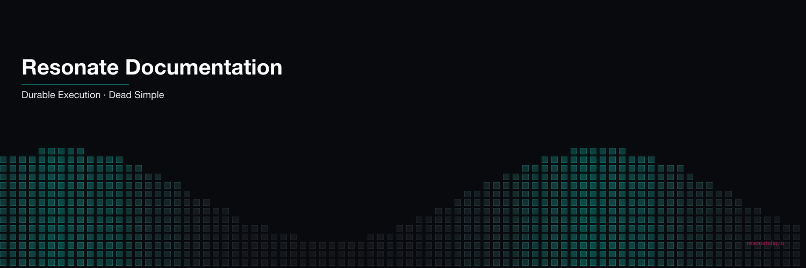

# Resonate documentation

Source for [https://docs.resonatehq.io](https://docs.resonatehq.io). Built with **Next.js 15 + fumadocs**, deployed to Vercel on push to `main`.

### [How to contribute](./CONTRIBUTING.md)

### [Get started with Resonate](https://docs.resonatehq.io/get-started/)

### [Evaluate Resonate for your next project](https://docs.resonatehq.io/evaluate/)

### [Example application library](https://github.com/resonatehq-examples)

### [The concepts that power Resonate](https://www.distributed-async-await.io/)

### [Join the Discord](https://resonatehq.io/discord)

### [Subscribe to the Blog](https://journal.resonatehq.io/subscribe)

### [Follow on X](https://x.com/resonatehqio)

### [Follow on LinkedIn](https://www.linkedin.com/company/resonatehqio)

### [Subscribe on YouTube](https://www.youtube.com/@resonatehqio)
